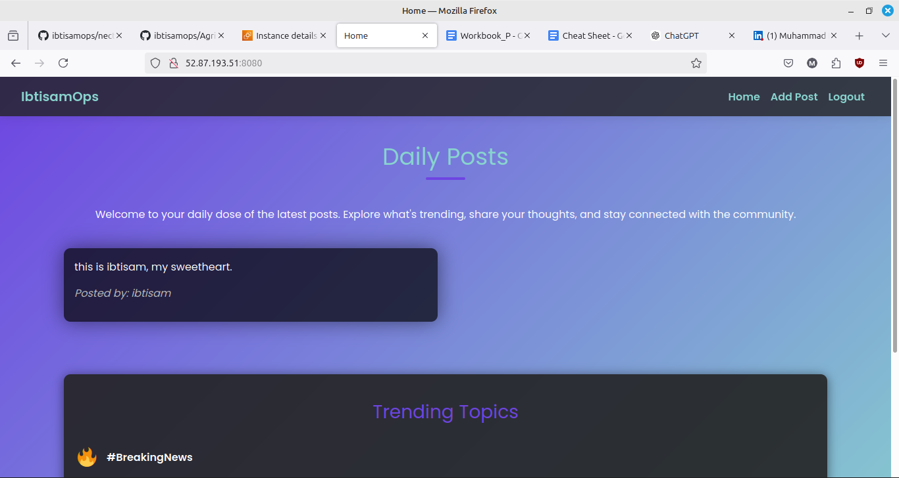

# Full Stack Java Blogging Application 

## Overview
This project is a Java-based blogging application that follows a 2-tier architecture, utilizing an H2 in-memory database. The application is designed to demonstrate a typical enterprise-level blogging system with a clear separation of concerns across the presentation, business logic, and data access layers.

## Project Structure
The project follows a standard Spring Boot structure with the following key directories and files:
- `src/main/java`: Contains the Java source code.
  - `controller`: Handles HTTP requests and responses.
  - `service`: Contains the business logic.
  - `repository`: Manages data access and database interactions.
  - `model`: Defines the data models and entities.
- `src/main/resources`: Contains configuration files and static resources.
  - `application.properties`: Configuration file for database and other settings.

## How to Run

1. **Clone the Repository**
2. **Open the Project**: Open the project in your IDE of choice.
3. **Run the Application**: Execute the application from your IDE.
4. **Access the Application**: The application will be accessible at `http://localhost:8080`.

## Project Snapshot

## Additional Information
Please refer to `consoleOutput.txt` for more details. 😊
